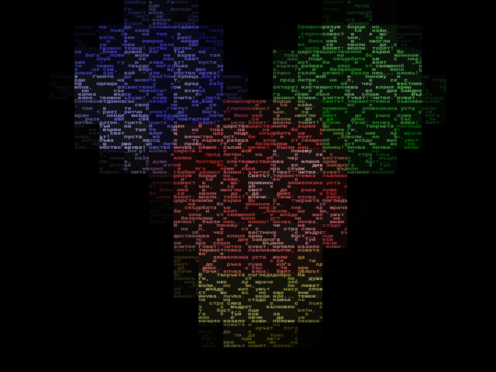

# Verse Shader

## About The Project


  This is a small project that uses golang and javascript with react and tailwind to create some pretty aesthetically unique ascii art images that stand out. Using an image and text which you provide you can generate the images using the [frontend](https://martinkurtev.com). There are a couple of parameters to tweak to get a better looking image. This was built as a project for school. Currently it doesn't have a lot of functionality, other than the single filter, but I am planning on adding more stuff to it.

## Getting Started

### Prerequisites

* a functional browser
* go
* npm

### Installation

_There should be a [live website](https://martinkurtev.com), but if it doesn't work or points to another page this is how you can host it yourself. 

1. Clone the repo
   ```sh
   git clone https://github.com/Clapzzy/ProseShader.git
   ```
3. Install NPM packages
   ```sh
   cd frontend
   npm install
   ```
4. Run the vite thing( maybe in dev mode if you don't want to build )
   ```js
   npm run dev
   ```
5. Run the backend
   ```sh
   cd ../backend
   go run main.go
   ```
6. Have fun


## More example images



